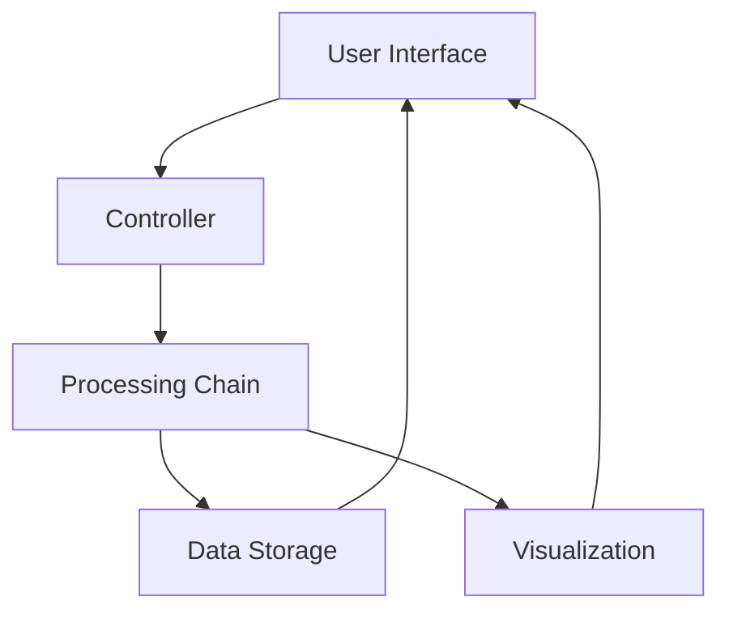
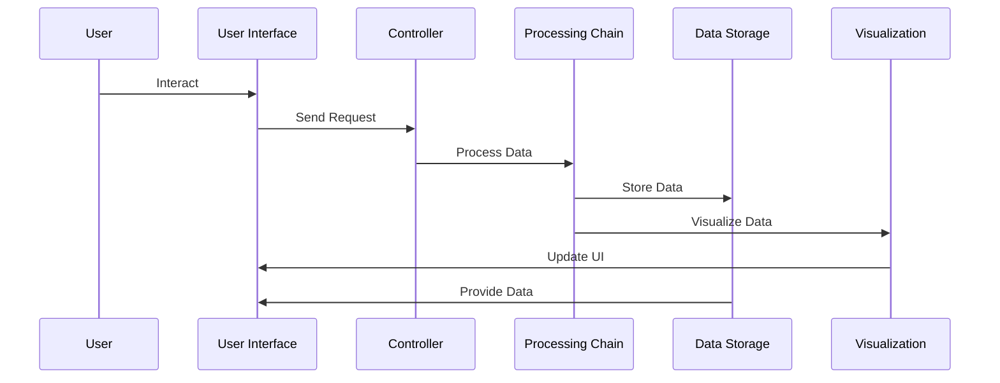
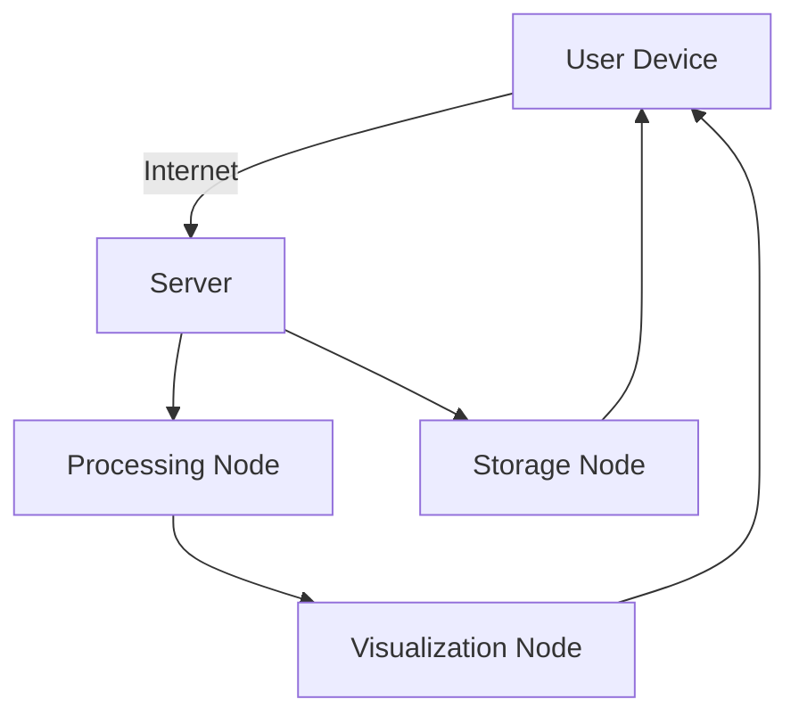

# Visual Diagrams of Project Architecture, Sequence, and Deployment

## Architecture Diagram

```mermaid
graph TD;
    A[User Interface] --> B[Controller];
    B --> C[Processing Chain];
    C --> D[Data Storage];
    C --> E[Visualization];
    E --> A;
    D --> A;
```

## Sequence Diagram

```mermaid
sequenceDiagram
    participant User
    participant UI as User Interface
    participant Controller
    participant Processing as Processing Chain
    participant Storage as Data Storage
    participant Visualization

    User->>UI: Interact
    UI->>Controller: Send Request
    Controller->>Processing: Process Data
    Processing->>Storage: Store Data
    Processing->>Visualization: Visualize Data
    Visualization->>UI: Update UI
    Storage->>UI: Provide Data
```

## Deployment Diagram

```mermaid
graph TD;
    A[User Device] -->|Internet| B[Server];
    B --> C[Processing Node];
    B --> D[Storage Node];
    C --> E[Visualization Node];
    E --> A;
    D --> A;
```
